 
# 公众号：安全狗的自我修养
# github.com/haidragon

# windows wdm驱动开发视频教程 
## 基础部分
* 1.驱动介绍与调试环境搭建
* 2.helloworld驱动与安装
* 3.操作系统与指针回顾  
* 4.驱动对象与设备对象
* 5.驱动框架类型分类
* 6.内存管理操作与new重载
* 7.驱动中字符串处理与数据类型
* 8.驱动的布局与设备栈 
* 9.IRQ中断与IRP包结构
* 10.驱动程序与用户通信
* 11.常用文件操作与强删文件
* 12.注册表常用操作
* 13.内核线程
* 14.内核线程等待操作
* 15.同步机制-自旋锁
* 16.同步机制-互斥体
* 17.同步机制-信号量(灯)
* 18.同步机制-事件 
* 19.内核中使用链表
* 20.IRP同步与异步原理
* 21.IRP同步完成
* 22.IRP异步完成
* 23.IRP取消例程
* 24.StartIO例程
* 25.自定义StartIO(多队列)
* 26.定时器与等待
* 27.内核IO定时器
* 28.内核DPC定时器
* 29.延时阻塞方式定时
* 30.驱动中的时间操作
* 31.IRP超时处理
* 32.DPC与工作项操作文件案例 
* 33.驱动模块之间调用
* 34.通过句柄方式同步调用驱动
* 35.通过句柄方式异步调用驱动
* 36.直接创建IRP包调用驱动
* 37.分层驱动原理介绍
* 补1.windows驱动开发之双物理机网络远程调试
* 补2.windows驱动开发之虚拟机串口调试
* 补3.windows驱动开发之双物理机usb调试 
* 38.即插即用与寻找设备
* 39.为实际硬件安装自定义驱动
* 40.用实例演示png底层原理
* 41.设备启动与设备信息
* 42.电源管理状态与转换
* 43.电源处理案例  
* 44.IO端口介绍
* 45.64位编写汇编与调用约定
* 46.汇编实现IO端口操作
* 47.pci总线介绍与获取 
* 48.usb规范与libusb介绍
* 49.usb硬件驱动案例

# WDF驱动开发视频教程 
* 0.WDF驱动开发介绍
* 1.对象的本质
* 2.双机调试开发环境搭建　
* 3.设备与驱动的层次结构
* 4.WDF写原NT式驱动 
* 5.WDF体系结构介绍
* 6.WDF对象模型
* 7.WDF上下文与宏定义
* 8.DriverEntry例程
* 9.TraceEvents日志调试
* 10.WDF驱动IO模型
* 11.打开与关闭例程
* 12.读写控制例程
* 13.特定IRP包例程处理
* 14.IRP对象封装
* 15.创建请求队列
* 16.从请求检索缓冲区
* 17.NEITHER方式IO操作
* 18.注册取消例程
* 19.IO操作Parallel模式
* 20.Manual模式与多队列
* 21.WDF驱动字符串对象
* 22.WDF驱动注册表对象
* 23.WDF同步机制
* 24.WDF内核事件处理
* 25.WDF驱动锁对象
* 26.WDF定时器对象 
* 27.利用定时器IO操作
* 28.WDF驱动工作项对象
* 29.WDF驱动中复合数据
* 30.WDF驱动内存操作
* 31.可配置设备资源对象
* 32.WDF驱动其它操作
* 33.电源管理与PNP事件
* 34.WDF单独注册WDM式IRP
* 35.wdf与wdm驱动之间通信
* 36.PCI与USB开发介绍
* 37.WDF过滤驱动介绍与案例
 
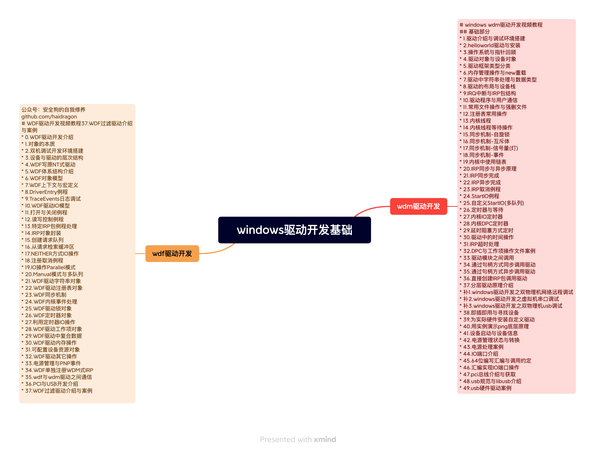
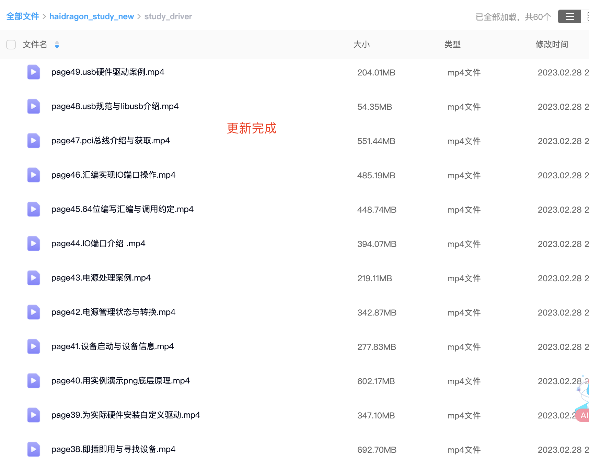
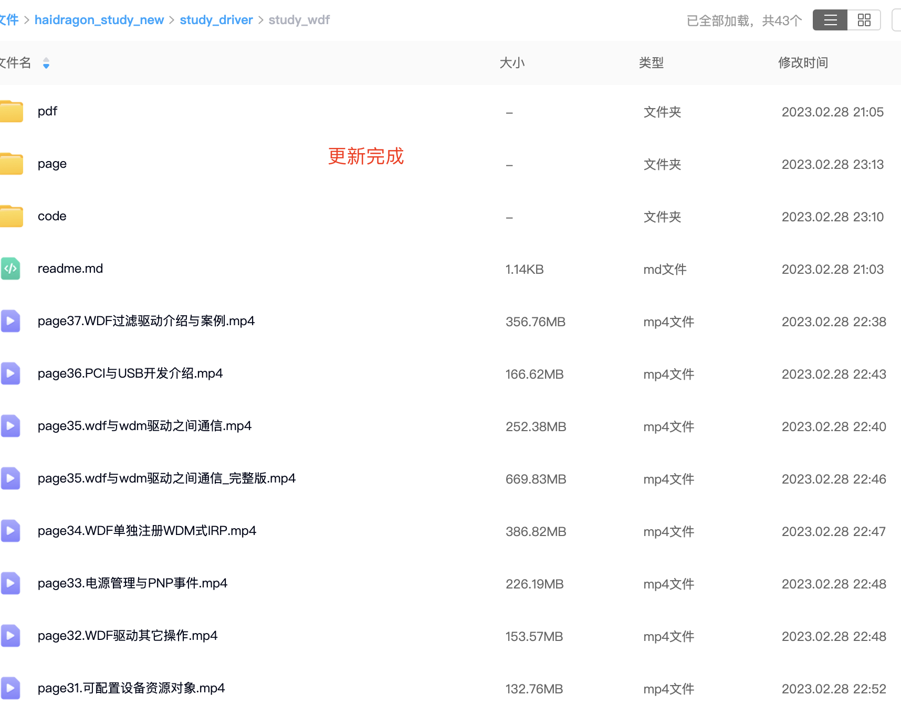

# windows程序开发视频教程(2023最新) 
* 0.课程介绍
## 源码阅读与书
* 1.wrk源码介绍
* 2.ReactOS源码分析
* 3.windows server 2003源码 
* 4.windows调试符号
* 5.应用程序开发相关书介绍
* 6.驱动开发与内核原理相关书介绍
* 7.其它一些相关书介绍
  
## 系统概述
* 8.windows发展与架构
* 9.windows应用程序
* 10.系统调用
* 11.进程与分类
* 12.线程与分类
* 13.系统启动(引导)
* 14.驱动、服务与模块
* 15.进程通信
* 16.线程同步
* 17.内核对象与IO操作 

## 窗口程序
* 18.第一个程序
* 19.unicode
* 20.窗口
* 21.事件与消息机制
* 22.键盘鼠标事件
* 23.输出文字
* 24.图形基础介绍
* 25.控制与交互(控件)
* 26.窗口绘画
* 27.坐标转换
* 28.时间操作
* 29.模仿迅雷实现剪切板监听
* 30.实现以管理员权限运行(提权)
* 31.其它程序介绍

## 进程
* 32.进程基础概念
* 33.进程创建案例
* 34.进程间通信介绍
* 35.信号量
* 36.共享内存
* 37.内存映射文件
* 38.消息队列
* 39.管道
* 40.邮槽
* 41.剪贴板
* 42.本地过程调用(LPC)
* 43.远程过程调用(RPC)
* 44.本地高级过程调用(ALPC)
* 45.套接字(网络)
* 46.视窗报文与其它
* 47.进程源码分析介绍
* 48.内存映射源码分析
* 49.进程结构 
* 50.进程的句柄表
* 51.进程的访问令牌  
* 52.进程Pcb结构
* 53.动态调试win11进程结构
* 54.进程PEB结构
* 55.了解进程的创建与结束

 
## 线程
* 56.线程基础概念
* 57.线程创建案例
* 58.线程同步介绍
* 59.线程同步机制-临界区
* 60.线程同步机制-互斥体
* 61.线程同步机制-信号量
* 62.线程同步机制-事件
* 63.线程同步机制-等待对象
* 64.线程同步机制-读写锁
* 65.线程同步机制-定时器
* 66.线程同步机制-条件变量
* 67.线程同步机制-其它操作
* 68.线程调试介绍
* 69.线程结构
* 70.线程本地存储TLS
* 71.线程TCB与Teb结构
* 72.动态调试与其它介绍

## 进程线程操作介绍
* 73.注入与劫持介绍
* 74.跨进程访问(附加、挂靠)
* 75.傀儡进程介绍(进程挖空)
* 76.APC机制介绍
* 77.PRocMon介绍与使用
* 78.PRocMon实现原理

## 内存
* 80.内存管理概述
* 81.页式内存管理介绍
* 82.段式内存管理介绍
* 83.windows内存管理介绍与算法介绍
* 84.windows系统内存管理介绍
* 85.windows进程内存管理介绍
* 86.MemMon工具与原理介绍
  
# I/O系统
* 87.I/O系统概述
* 88.I/O管理器介绍
* 89.驱动与驱动对
* 90.设备对象与设备栈
* 91.PNP管理器介绍  
* 92.电源管理器介绍
* 93.设备分类、列举、设备树
* 94.I/O处理流程介绍 
* 95.IRPMon工具与原理
  
# hack编程
* 96.hook原理 
* 97.windows消息hook
* 98.内联(inline)hook
* 99.64位内联hook
* 100.IAT hook
* 101.异常处理hook
* 102.hook框架
* 103.注入原理 
* 104.进程挂靠
* 105.远程线程注入 
* 106.IAT注入 
* 107.APC式注入 
* 108.反射式注入
* 109.com注入
* 110.process-hollowing
* 111.进程dump
* 111.hide进程
* 112.dll隐藏
* 113.内存加载dll
* 114.dll2shellcode
* 115.dll2exe
* 115.驱动创建用户进程

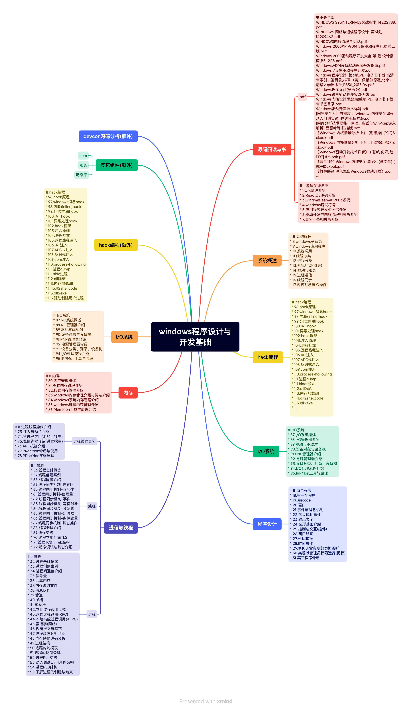
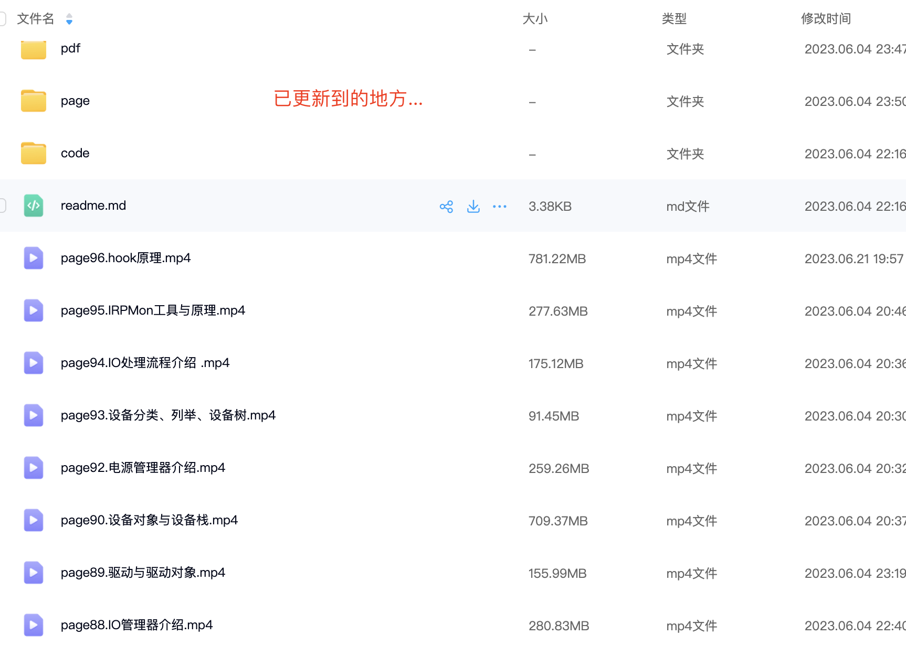

 
# windows上usb过滤与透传(虚拟化)视频教程 
* 0.windows上usb过滤与透传(虚拟化)视频介绍

## 基于usbview源码了解usb
* 1.usbview使用  
* 2.usbview源码编译
* 3.打开显示描述信息
* 4.魔改后的命令行版
* 5.usbview源码分析
* 6.组织usb的知识与设备打开
* 7.模仿写个设备描述符demo
* 8.驱动层实现设备描述符获取
* 9.遍历物理设备对象名称
* 10.遍历所有winobj对象
* 11.wdf驱动usb操作介绍
* 12.驱动遍历接口描述符
* 13.驱动获取厂家字符串信息

 
## 深入分析usb标准协议 
* 14.usb技术概述
* 15.USB总线结构
* 16.usb电源管理
* 17.USB架构与重要概念
* 18.BusHound分析工具使用
* 19.USBlyzer分析工具使用
* 20.USBTrace分析工具使用
* 21.USB Monitor Pro使用
* 22.USB Monitor（Device Monitoring Studio）
* 23.wireshark与其它抓包工具
* 24.USB协议描述符介绍
* 25.USB协议设备描述符
* 26.USB协议配置描述符 
* 27.USB协议接口描述符
* 28.字符串和语言ID描述符
* 29.USB协议端点描述符
* 30.USB设备其它描述符
* 31.USB帧和微帧
* 32.USB协议传输、事务与包
* 33.控制传输及事务组成
* 34.同步传输及事务组成
* 35.批量传输及事务组成
* 36.中断传输及事务组成
* 37.USB协议-事务总结
* 38.最小单位-包(组成与分类)
* 39.USB包-命令类包Token
* 40.USB包-数据类包DATA
* 41.USB包-握手类包Handshake
* 42.USB包-控制传输包结构
* 43.USB包-同步传输包结构
* 44.USB包-批量传输包结构
* 45.USB包-中断传输包结构
* 46.usb的枚举(基于windows)
* 47.usb的常用标准请求
* 48.通过libusb读取鼠标数据

 
## USBPcap源码分析    
* 49.USBPcap源码编译调试与使用
* 50.USBPcap入口函数分析
* 51.USBPcap注册成过滤驱动
* 52.AddDevice函数分析
* 53.USBPcap设备附加原理分析
* 54.png例程函数分析
* 55.动态调试验证设备附加原理
* 56.DkCreateClose函数分析
* 57.DkReadWrite函数分析
* 58.DkDevCtl函数分析
* 59.DkInDevCtl函数分析
* 60.USBPcap其它函数分析  
* 61.用户层分析(遍历主控器并获取信息) 
* 62.用户层分析(选择过滤主控器) 
* 63.usbpcap数据包获取
* 64.不重启电脑附加设备分析 
* 65.USBPcap过滤驱动总结
# 键盘鼠标过滤器
* 66.键盘过滤器原理分析
* 67.键盘过滤器代码讲解
* 68.鼠标过滤驱动
## usbdk源码分析  
* 69.云桌面开源方案使用演示 
* 70.usbdk源码编译与调试
* 71.单独提取usbdk项目源码
* 72.usbdk安装成过滤器分析
* 73.重写usbdk安装程序
* 74.usbdk与libusb操作介绍
* 75.libusb接口源码分析
* 76.usbdk整体结构跟类介绍
* 77.usbdk入口函数分析
* 78.usbdk怎么附加设备
* 79.libusb的open操作源码分析
* 80.open时候句柄被占问题
* 81.libusb的遍历设备源码分析
* 82.libusb的close操作问题
* 83.adddevice函数分析
* 84.入队列前的SetCallbacks分析
* 85.Strategy的选择
* 86.NullFilterStrategy分析
* 87.FilterStrategy分析
* 88.HubFilterStrategy分析
* 89.HiderStrategy分析
* 90.RedirectorStrategy分析 
* 91.usbdk的各种ioctls分析
* 92.usbdk的电源管理
* 93.重定向逻辑再次梳理与open问题
* 94.总结

## 虚拟总线
* 95.总线与虚拟总线介绍
* 96.虚拟总线案例演示
* 97.虚拟总线-adddevice源码分析
* 98.动态调试分析虚拟总线设备堆栈
* 99.虚拟总线-控制io源码分析
* 100.注册成虚拟总线原理分析
* 101.继续分析什么是查询总线关系
* 102.用户层简单控制代码分析
* 103.虚拟总线实现设备插源码分析
* 104.虚拟总线实现设备拔源码分析
* 105.虚拟总线实现设备弹出源码分析
* 106.pdo与fdo的pnp总结
* 107.虚拟总线-电源管理分析
* 108.虚拟总线-其它操作函数分析
* 109.功能驱动的安装问题
* 110.动态调试分析功能驱动设备堆栈
* 111.功能驱动的源码简单分析 
* 112.整个设备栈过滤驱动介绍
* 113.各层上下过滤驱动介绍与代码分析(功能驱动、总线、class类驱动)
* 114.虚拟总线总结

## usbip源码分析(windows)
### 整体架构
* 115.usbip介绍(USB透传) 
* 116.windows上usbip测试
* 117.回顾虚拟usb总线原理
* 118.usbip整个项目代码构架了解
* 119.设备的属性信息获取
* 120.再次理解(pci、usb总线、根设备、主控制器、控制器、集线器) 
   
 
### 虚拟总线
* 121.源码调试分析与adddevice函数简单了解
* 122.vhci-初步了解usbip设备栈
* 123.vhci-简单了解下各FDO和PDO设备数据类型
* 124.vhci-虚拟根设备FDO创建过程
* 125.vhci-虚拟控制器PDO创建过程
* 126.vhci-虚拟根设备png查询处理
* 127.vhci-虚拟控制器FDO创建过程
* 128.vhci-虚拟集线器PDO创建过程
* 129.vhci-虚拟控制器png查询处理
* 130.vhci-虚拟集线器FDO创建过程
* 131.vhci-虚拟集线器子设备PDO创建过程
* 132.vhci-虚拟集线器png查询处理
* 133.vhci-MN_START_DEVICE
* 134.vhci-MN_REMOVE_DEVICE
* 135.vhci-process_pnp_vpdo
* 136.vhci-RESOURCE相关 
* 137.vhci-ioctl操作
* 138.vhci-读写操作
* 139.vhci-其它操作处理

### 客户端

* 140.stub-创建与关闭源码分析
* 141.stub-adddevice源码分析
* 142.stub-读写例程源码分析
* 143.stub-控制io源码分析
* 144.stub-电源与pnp源码分析
* 145.用户程序-安装信息获取分析
* 146.怎么透传设备(本地处理)
* 147.数据通信逻辑

 
### usb安全管控

* 148.usb管控介绍
* 149.usb管控常用方案介绍  
* 150.遍历所有usb设备路径与id
* 151.遍历所有硬盘(存储)设备路径
* 152.遍历所有盘符(卷)
* 153.安全弹出盘符对应的U盘
* 154.usb设备与盘符映射 应问题
* 155.usb唯一标识符问题
* 156.多方案重置usb(restart) 
* 157.usbtreeview逆向分析
* 158.usb用户层操作api注意事项
* 159.设备常规状态获取
* 160.从xp到win11通用性问题
* 161.驱动层-usb管控设计
* 162.驱动层-过滤层级问题
* 163.驱动层-单机版黑白名单问题
* 164.驱动层-联网版项目设计介绍
* 165.驱动层-usb管控绕过对抗问题
* 166.pnpmgr管理器介绍
* 167.如何找到pnpmgr相关代码
* 168.pnpmgr代码自举(整个系统第一个设备创建)
* 169.设备管理器分析所有设备关系树
* 170.pnpmgr加载注册的所有设备
* 171.windows内核启动流程
* 172.usbstor介绍
* 173.usbstor源码分析
* 174.什么时候IRP会自下而上
* 175.usbstor的PNP处理
* 176.usbstor当栈底(创建子代PDO)
* 177.usbccgp通用驱动介绍
* 178.源码调试usbstor与usbccgp
* 179.为何U盘通过盘符获取不了十六进制的vid与pid 
* 180.解决通过盘符也能获取十六进制的vid与pid
 
* 补1.usbdk源码分析-所有设备列表
* 补2.修复hub复合设备重向定后bug(拔掉设备usbdk设备列表还在)
* 补3.虚拟总线怎么出pdo的原理分析
* 补4.某sxf大厂usb透传客户端解决方案逆向分析
 

视频教程.png)
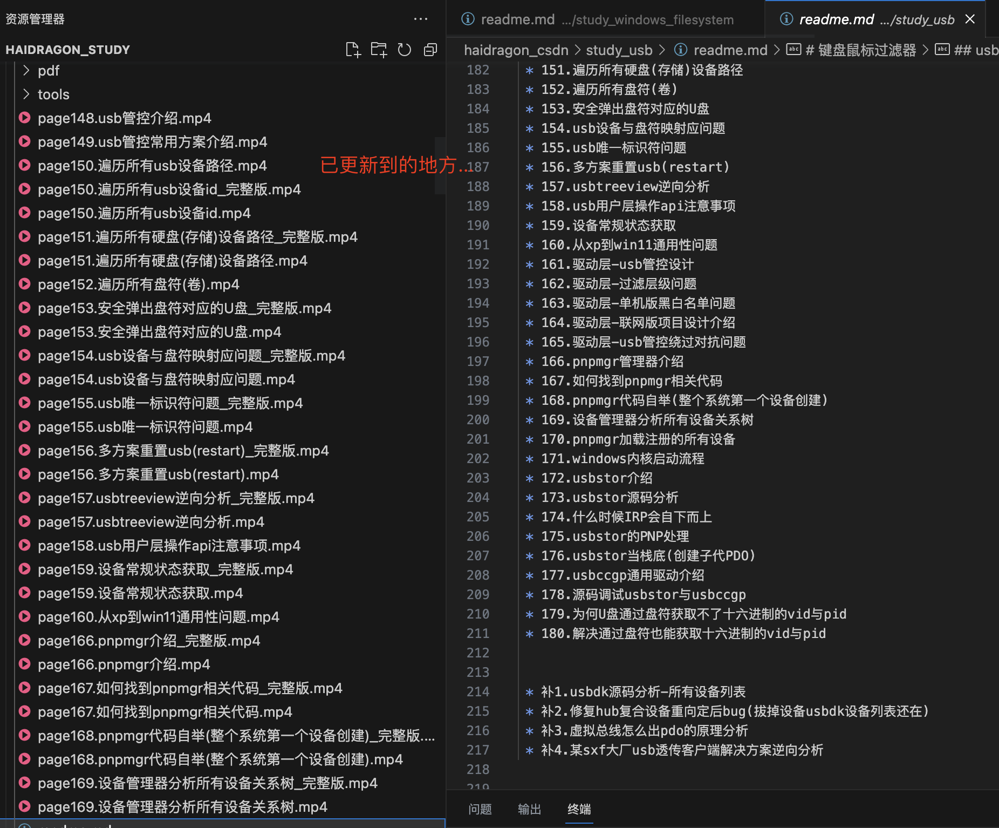

# 更新中的...

# windows游戏安全

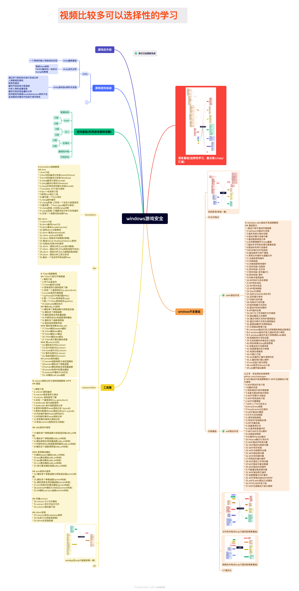

# windbg高级使用

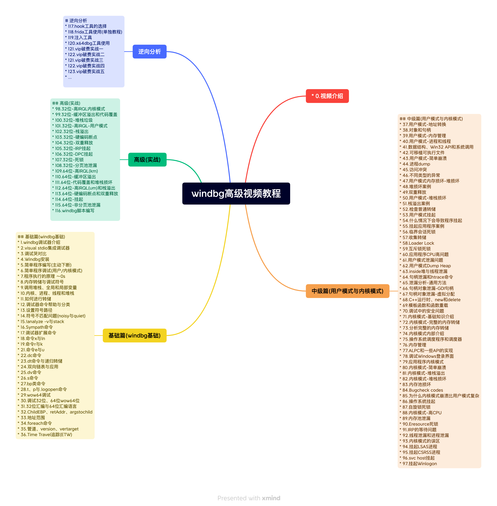

# windows网络安全与底层原理

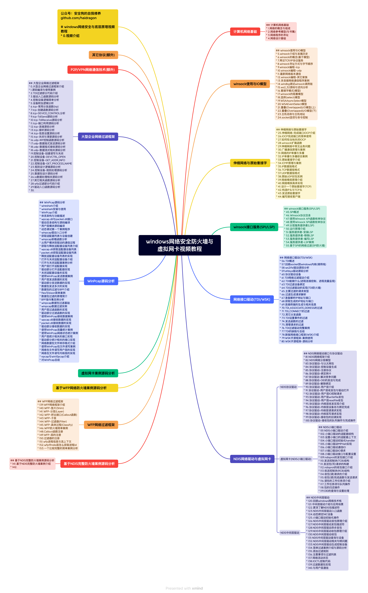
# windows文件过滤与加解密

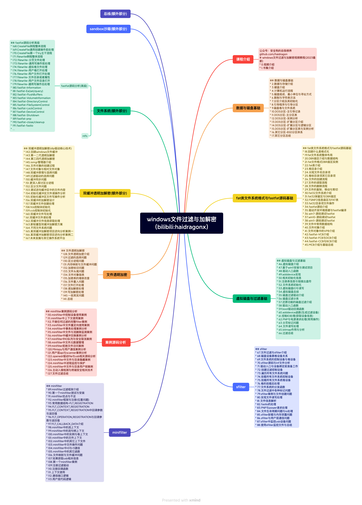

# 恶意软件开发与免杀对抗视频教程

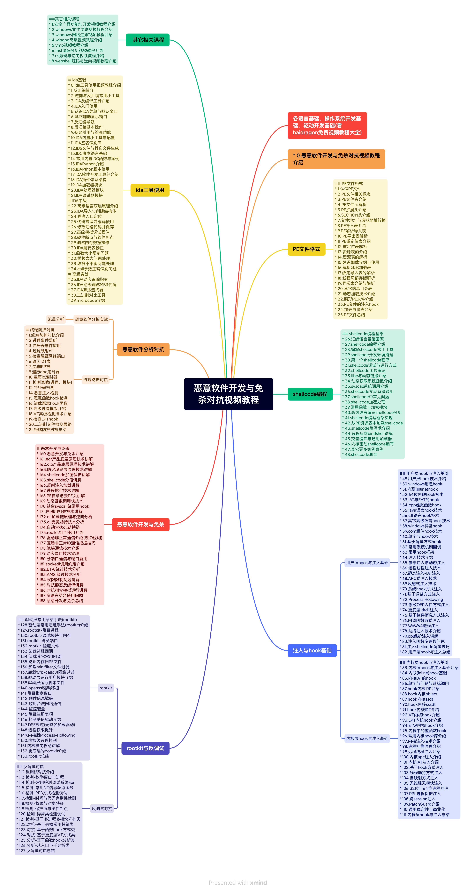
